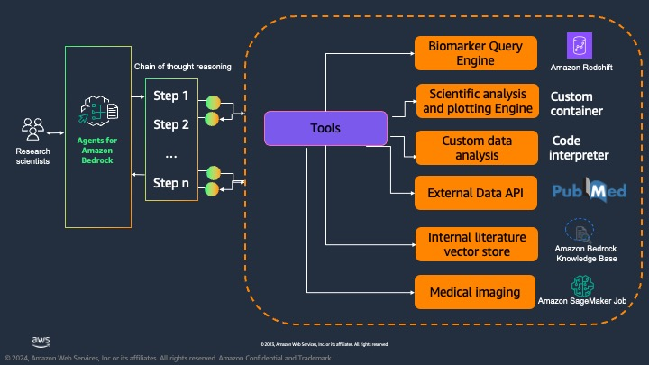
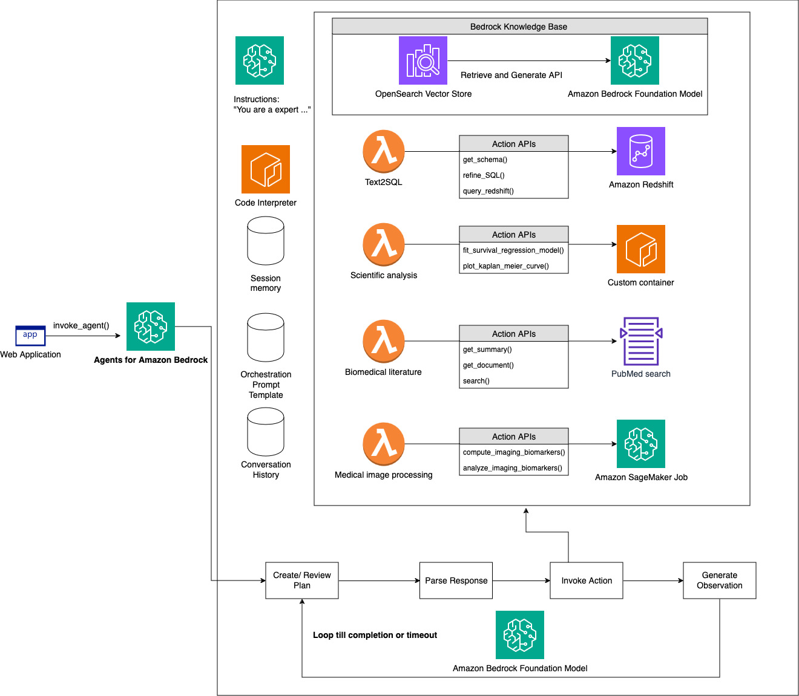
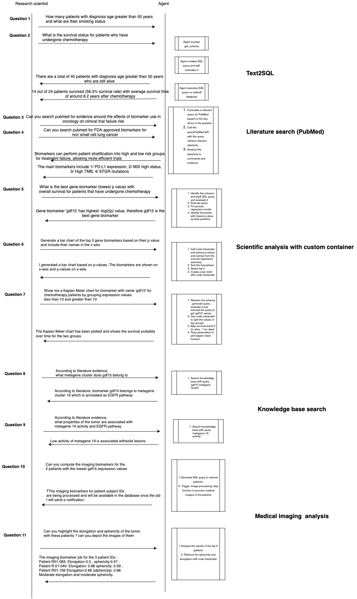

# Accelerate analysis and discovery of cancer biomarkers with Agents for Bedrock
## Overview
In oncology, it is well recognized that more than 95% of drugs or compounds in development fail in Phase I clinical trials, where a typical trial can cost between $800 million to $1.4 billion. A biomarker is measured in blood , body fluids, or tissues as an indicator of normal biological processes, pathogenic processes, or responses to therapeutic interventions. Biomarkers for patient stratification can improve the probability of success in clinical development; the average is between double and triple, but it can be as high as five-fold. 

In this solution, we show you how agentic workflows with LLMs from Amazon Bedrock leverage planning, tool-use, and self-reflection to transform complex oncology research queries into actionable insights. We define an example analysis pipeline, specifically for lung cancer survival with clinical, genomics and radiology modalities of biomarkers. We showcase a variety of tools including database retrieval with Text2SQL, statistical models and visual charts with scientific libraries, biomedical literature search with public APIs and internal evidence, and medical image processing with Amazon SageMaker jobs. We demonstrate advanced capabilities of agents for self-review and planning that help build trust with end users by breaking down complex tasks into a series of question and answers and showing the chain of thought to generate the final answer.

## Biomarker analysis workflow
The biomarker analysis workflow is illustrated below that incorporates multimodal data, including clinical, genomic, and CT scan imaging data. We augment this pipeline with Agents for Amazon Bedrock.

## Architecture Overview
The solution architecture is illustrated below. 

Agents for Amazon Bedrock enable generative AI applications to execute multistep tasks across company systems and data sources. We define our solution to include planning and reasoning with multiple tools including
-	Biomarker query engine:  Convert natural language questions to SQL statements and execute on an Amazon Redshift database of biomarkers. 
-	Scientific analysis and plotting engine: Use lifelines library with clinical and genomics data to build survival regression models like COX proportional hazard model and visualization like Kaplan Meier charts for survival analysis. 
-	External data API: Use PubMed apis to search biomedical literature for specific evidence. 
-	Internal literature: Use Knowledge Bases for Bedrock to give agents contextual information from internal literature evidence for RAG to deliver more relevant, accurate, and customized responses 
-	Medical imaging: Use Amazon SageMaker Jobs to augment agents with the capability to trigger asynchronous jobs with an ephemeral cluster to process CT scan images that include 2D slices to 3D volumes conversion, CT and segmentation masks alignment, radiomic feature extraction within the tumor region.

### What Does the Input Data Look Like?
We reuse the multimodal data analysis pipeline from this solution(https://github.com/aws-samples/machine-learning-pipelines-for-multimodal-health-data/tree/sagemaker-soln-lcsp) for Non-Small Cell Lung Cancer (NSCLC). 
The [Non-Small Cell Lung Cancer (NSCLC) Radiogenomics dataset](https://wiki.cancerimagingarchive.net/display/Public/NSCLC+Radiogenomics) consists a cohort of early stage NSCLC patients referred for surgical treatment. Prior to surgical procedures, Computed Tomography (CT) and Positron Emission Tomography/CT (PET/CT) are performed. Samples of tumor tissues were used to obtain mutation data and gene expresssion data by RNA sequencing technology. Clinical and demographic information were recorded for the patients as well. Each data modality (imaging, genomic, clincal) presents different view of a patient.

Details for each modality is described below.

#### Genomic 
Total RNA was extracted from the tumor tissue and analyzed with RNA sequencing technology. 
The dataset file that is available from the source was pre-processed using open-source tools including STAR v.2.3 for alignment and Cufflinks v.2.0.2 for expression calls. Further details can be found in [3]. The original dataset (GSE103584_R01_NSCLC_RNAseq.txt.gz) is also available in https://www.ncbi.nlm.nih.gov/geo/query/acc.cgi?acc=GSE103584.

While the original data contains more than 22,000 genes, we keep 21 genes from 10 highly coexpressed gene clusters (metagenes) that were identified, validated in publicly available gene-expression cohorts, and correlated with prognosis [3]. These are genes corresponding to Metagenes 19, 10, 9, 4, 3, 21 in Table 2 in [3]. 

After gene selection from the source data, the dataset looks like

| Case_ID   |    LRIG1 |    HPGD |     GDF15 |    CDH2 |    POSTN |  ......  |
|:----------|---------:|--------:|----------:|--------:|---------:|---------:|
| R01-024   | 26.7037  | 3.12635 | 13.0269   | 0       | 36.4332  |  ......  |
| R01-153   | 15.2133  | 5.0693  |  0.908663 | 0       | 32.8595  |  ......  |
| R01-031   |  5.54082 | 1.23083 | 29.8832   | 1.13549 | 34.8544  |  ......  |
| R01-032   | 12.8391  | 7.21931 | 12.0701   | 0       |  7.77297 |  ......  |
| R01-033   | 33.7975  | 3.19058 |  5.43418  | 0       |  9.84029 |  ......  |

The values denote expression level for each gene per patient. A higher number means that that specific gene is highly expressed in that specific tumor sample.

#### Clinical record
The clinical records are stored in CSV format. Each row corresponds to a patient and the columns represent information about the patients, including demographics, tumor stage, and survival status. 

| Case ID   | Survival Status   |  Age at Histological Diagnosis | Weight (lbs)   | Smoking status   | Pack Years    |   Quit Smoking Year | Chemotherapy   | Adjuvant Treatment   | EGFR mutation status   |  ......  | 
|:----------|--------------------------------:|:---------------|:-----------------|:--------------|--------------------:|:---------------|:---------------------|:-----------------------|:---------|:------------------|
| R01-005   | Dead              |                             84 | 145            | Former           | 20            |                1951 | No             | No                   | Wildtype               |  ......  | 
| R01-006   | Alive             |                           62 | Not Collected  | Former           | Not Collected |                 nan | No             | No                   | Wildtype               |  ......  | 
| R01-007   | Dead              |                            68 | Not Collected  | Former           | 15            |                1968 | Yes            | Yes                  | Wildtype               |  ......  | 
| R01-008   | Alive             |                           73 | 102            | Nonsmoker        | nan           |                 nan | No             | No                   | Wildtype               |  ......  | 
| R01-009   | Dead              |                             59 | 133            | Current          | 100           |                 nan | No             | No                   | Wildtype               |  ......  |

#### Medical imaging
Medical imaging biomarkers of cancer promise improvements in patient care through advances in precision medicine. Compared to genomic biomarkers, imaging biomarkers provide the advantages of being non-invasive, and characterizing a heterogeneous tumor in its entirety, as opposed to limited tissue available via biopsy [2]. In this dataset, CT and PET/CT imaging sequences were acquired for patients prior to surgical procedures. Segmentation of tumor regions were annotated by two expert thoracic radiologists. Below is an example overlay of a tumor segmentation onto a lung CT scan (case R01-093).

## Chain of thought reasoning example
Here is an example chain of thought sequence with the agent. 11 questions are listed in the image with their expected responses.  

## Deployment

## License
This project is licensed under the MIT License. The open-souce packages used in this project are under these [licenses](https://sagemaker-solutions-prod-us-east-2.s3-us-east-2.amazonaws.com/sagemaker-lung-cancer-survival-prediction/1.0.0/LICENSE.txt).

Users of the dataset must abide by [TCIA's Data Usage Policy](https://wiki.cancerimagingarchive.net/display/Public/Data+Usage+Policies+and+Restrictions) and the [Creative Commons Attribution 3.0 Unported License](https://creativecommons.org/licenses/by/3.0/) under which it has been published.

## Citation
We reuse the multimodal data analysis pipeline from this solution(https://github.com/aws-samples/machine-learning-pipelines-for-multimodal-health-data/tree/sagemaker-soln-lcsp)

## Legal Notes
**Important**: This solution is for demonstrative purposes only. It is not for clinical use and is not a substitute for professional medical advice, diagnosis, or treatment. **The associated notebooks, including the trained model and sample data, are not intended for production.** It is each customers’ responsibility to determine whether they are subject to HIPAA, and if so, how best to comply with HIPAA and its implementing regulations. Before using AWS in connection with protected health information, customers must enter an AWS Business Associate Addendum (BAA) and follow its configuration requirements.
